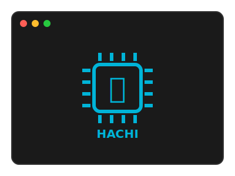

# Hachi - CHIP-8 Emulator

<div align="center">
  
</div>

A CHIP-8 emulator written in Rust (for learning purposes 😁).

## About CHIP-8

**CHIP-8** is an interpreted programming language developed by Joseph Weisbecker in the mid-1970s for 8-bit microcomputers like the COSMAC VIP and Telmac 1800. Originally designed to be easy to program and use minimal memory, CHIP-8 features a simple virtual machine with 4KB of memory, a 64×32 pixel monochrome display, 16 8-bit registers, and 35 two-byte instructions. Despite its minimalist design, CHIP-8 became popular for creating simple video games and has remained relevant in hobbyist communities, evolving from 1970s microcomputers to 1990s graphing calculators and modern emulation projects, making it an ideal platform for learning emulator development.

## Usage

```bash
# Run the emulator
cargo run

# Run tests
cargo test

# Run specific test suite
cargo test load_rom_tests
cargo test load_font_tests
cargo test instructions_tests
```

## CHIP-8 Instruction Implementation Progress

### Standard CHIP-8 Instructions

#### System & Control Flow
- [x] **00E0** - CLS (Clear Display)
- [x] **00EE** - RET (Return from subroutine)
- [ ] **0nnn** - SYS addr (System call - usually ignored)
- [x] **1nnn** - JP addr (Jump to address)
- [x] **2nnn** - CALL addr (Call subroutine)

#### Conditional Instructions
- [x] **3xkk** - SE Vx, byte (Skip if Vx == byte)
- [x] **4xkk** - SNE Vx, byte (Skip if Vx != byte)
- [x] **5xy0** - SE Vx, Vy (Skip if Vx == Vy)
- [ ] **9xy0** - SNE Vx, Vy (Skip if Vx != Vy)

#### Load Instructions
- [x] **6xkk** - LD Vx, byte (Set Vx = byte)
- [ ] **8xy0** - LD Vx, Vy (Set Vx = Vy)
- [ ] **Annn** - LD I, addr (Set I = addr)

#### Arithmetic & Logic
- [x] **7xkk** - ADD Vx, byte (Add byte to Vx)
- [x] **8xy1** - OR Vx, Vy (Vx = Vx OR Vy)
- [x] **8xy2** - AND Vx, Vy (Vx = Vx AND Vy)
- [ ] **8xy3** - XOR Vx, Vy (Vx = Vx XOR Vy)
- [ ] **8xy4** - ADD Vx, Vy (Add Vy to Vx, set VF = carry)
- [ ] **8xy5** - SUB Vx, Vy (Subtract Vy from Vx, set VF = NOT borrow)
- [ ] **8xy6** - SHR Vx {, Vy} (Shift right)
- [ ] **8xy7** - SUBN Vx, Vy (Set Vx = Vy - Vx, set VF = NOT borrow)
- [ ] **8xyE** - SHL Vx {, Vy} (Shift left)

#### Jump & Random
- [ ] **Bnnn** - JP V0, addr (Jump to addr + V0)
- [x] **Cxkk** - RND Vx, byte (Set Vx = random & byte) ⚠️ *Needs integration*

#### Graphics
- [ ] **Dxyn** - DRW Vx, Vy, nibble (Draw sprite)

#### Input
- [ ] **Ex9E** - SKP Vx (Skip if key Vx is pressed)
- [ ] **ExA1** - SKNP Vx (Skip if key Vx is not pressed)

#### Timers & Memory
- [ ] **Fx07** - LD Vx, DT (Set Vx = delay timer)
- [ ] **Fx0A** - LD Vx, K (Wait for key press, store in Vx)
- [ ] **Fx15** - LD DT, Vx (Set delay timer = Vx)
- [ ] **Fx18** - LD ST, Vx (Set sound timer = Vx)
- [ ] **Fx1E** - ADD I, Vx (Add Vx to I)
- [ ] **Fx29** - LD F, Vx (Set I = location of sprite for digit Vx)
- [ ] **Fx33** - LD B, Vx (Store BCD representation of Vx)
- [ ] **Fx55** - LD [I], Vx (Store V0-Vx in memory starting at I)
- [ ] **Fx65** - LD Vx, [I] (Read V0-Vx from memory starting at I)

## References

- [Austin Morlan - Building a CHIP-8 Emulator [C++]](https://austinmorlan.com/posts/chip8_emulator)
- [Cowgod's CHIP-8 Technical Reference](http://devernay.free.fr/hacks/chip8/C8TECH10.HTM)
- [CHIP-8 Wikipedia](https://en.wikipedia.org/wiki/CHIP-8)

## License

MIT License 